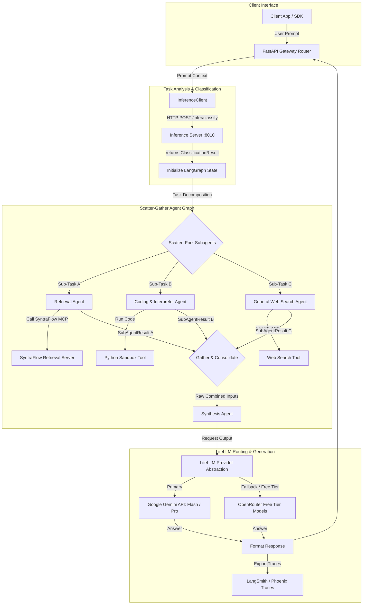

# GuardRoute: Multi-Agent Orchestrator & Routing Brain

GuardRoute is a production-grade agent orchestration and decision routing brain. It is designed to act as the cognitive gateway for user prompts, classifying task complexity on-demand, decomposing problems into parallel sub-tasks, executing them concurrently via specialized subagents (Scatter-Gather), and coordinating tool calls via the Model Context Protocol (MCP). It abstracts API calls across Google Gemini and OpenRouter free-tier models, calling a separate GPU-bound inference server to run offline classification tasks efficiently while conserving system resources.

---

### Tech Stack

| Component | Tool / Framework | Version / Context | Rationale |
| :--- | :--- | :--- | :--- |
| **Agent Orchestration** | **LangGraph** & LangChain | Python SDK | Handles state management, loop routing, and complex parallel branching/merging (Scatter-Gather). |
| **Multi-Provider Routing** | **LiteLLM** / LangChain Chat | Python SDK | Unified interface to route calls across Google Gemini APIs and OpenRouter free-tier models, handling fallbacks and rate limits. |
| **Task Classifier Client** | `InferenceClient` (HTTP) | Python custom client | Calls the remote `inference` server's `/infer/classify` endpoint to fetch Arch-Router-1.5B classifications. No local VRAM footprint. |
| **MCP Integration** | Model Context Protocol Client | SDK Client Pool | Connects to local MCP tool servers and SyntraFlow's MCP retrieval server. |
| **Traces & Logs** | LangSmith / Phoenix | SDK Exporter | Distributed tracing of agent node executions, tool outputs, and routing decisions. |
| **Monitoring Dashboard** | Prometheus & Grafana | Dashboard | Scraping execution metrics, latency, and cost savings across various provider APIs. |
| **Containerization** | Docker | Linux Alpine Base | Lightweight container packaging for the CPU-only API gateway. |
| **Orchestration** | Kubernetes (K8s) | Deployment / Ingress | Automated scaling, self-healing routing, and load balancing of the API endpoints. |

---

### System Architecture & Data Flows

---

### Key Workflows & Processes

#### 1. On-Demand Classifier Loading & Task Classification
To run local models without consuming persistent GPU/RAM resources, task classification is delegated to the shared GPU inference server:
1. **Lazy Loading**: When a user request hits the FastAPI gateway, it calls the `InferenceClient.classify()` method. The inference server checks if the local `Arch-Router-1.5B` GGUF instance is loaded. If it is inactive, the inference server's VRAMManager dynamically loads the model into VRAM using `llama-cpp-python` (or evicts other models if needed to fit the VRAM budget).
2. **Intent & Complexity Classification**: The classifier analyzes the user's prompt to determine:
   - **Task Complexity**: `Simple` (direct completion), `Medium` (requires single tool/retrieval), or `Complex` (requires multi-step logic/multiple subagents).
   - **Subagents Required**: Identifies if retrieval, coding, or web search nodes need to be launched.
3. **Idle Unloading**: A background daemon in the inference server monitors model usage. If no requests are received for a configurable idle timeout (e.g., 5 minutes), the classifier instance is deleted from memory, freeing up system resources.

#### 2. Scatter-Gather Parallel Subagent Execution & Schema Contracts
For complex multi-modal requests:
1. **Task Decomposition**: The main LangGraph orchestrator splits the request into sub-tasks and updates the shared Graph State.
2. **Scatter Phase**: The graph forks execution, launching specialized subagents concurrently:
   - **Retrieval Agent**: Concurrently calls the SyntraFlow MCP server (`retrieve_documents` / `query_database`) to fetch document tables.
   - **Coding Agent**: Starts a Python code execution runner to prepare data analysis blocks.
   - **Search Agent**: Calls external web search APIs to fetch real-time commodity indices.
3. **Gather Phase & Partial Failures**: Subagents append their results matching the `SubAgentResult` Pydantic schema to the graph state. If a subagent times out or errors out, the gather node marks its status as `TIMEOUT` or `ERROR` and proceeds with the successful results, preventing a complete pipeline block. Once all parallel nodes finish or time out, the state merges.
4. **Consolidation & Synthesis**: The Synthesis Agent compiles the collected data chunks. It uses LiteLLM to call the optimal external model to produce the final coordinated answer.

#### 3. LiteLLM Multi-Provider Routing & Capability Isolation
1. **Unified Call Structure**: All agent generation calls are written using LiteLLM's standard Completion API via a shared helper `completion_with_fallback()`.
2. **Capability-Aware Prompting**: Subagents automatically update prompt structures and truncate payloads to fit when falling from Gemini to OpenRouter's free-tier models (which have smaller context limits and different tool formats).
3. **Rate-Limit & Error Recovery**: If the Google API key hits rate limits or quota exhausts, LiteLLM automatically intercepts the error and re-routes the payload to OpenRouter's free tier endpoints, ensuring high system availability.

---

#### 4. Production Scale-Out & Auditing (Kafka & Kubernetes)

1. **Async Auditing & Diagnostics (Kafka)**:
   - When GuardRoute runs a multi-agent orchestration session, it publishes complete session execution traces (including classification latency, subagent span results, token usage, and final answer texts) to the Kafka topic `guardroute-traces`.
   - This ensures that execution logging never blocks the synchronous user transaction thread, offloading analysis and monitoring to downstream services (like EvalOps).
2. **Kubernetes Orchestration**:
   - **Gateway Pods Autoscale**: The gateway containers (serving the `/api/guardroute/*` routes) are stateless CPU pods. They are scaled horizontally using Kubernetes Horizontal Pod Autoscalers (HPA) targeting high-concurrency user HTTP requests.
   - **Load Balancing**: Standard K8s Services load-balance user traffic across the replica pool, maintaining low response times.
